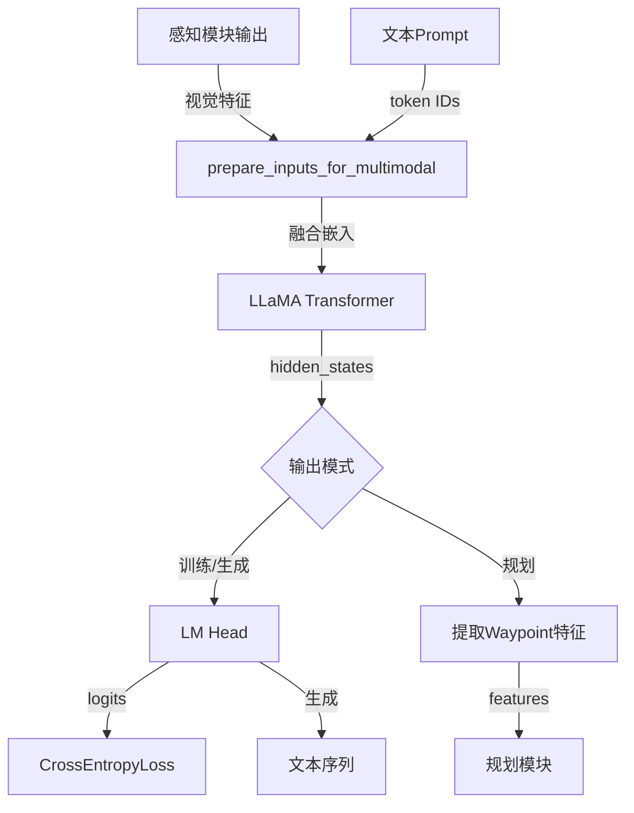

# LLaVA-LLaMA 架构分析

## 📋 目录
1. [整体架构](#整体架构)
2. [核心组件](#核心组件)
3. [数据流向](#数据流向)
4. [关键技术点](#关键技术点)
5. [在Orion中的应用](#在orion中的应用)

---

## 🏗️ 整体架构

LLaVA (Large Language and Vision Assistant) 是一个多模态大语言模型，将视觉和语言能力结合在一起。

### 架构概览

```
┌────────────────────────────────────────────────────────────┐
│                    LLaVA-LLaMA Architecture                 │
├────────────────────────────────────────────────────────────┤
│                                                            │
│  ┌──────────────┐         ┌──────────────┐              │
│  │ 感知模块      │         │ 文本输入     │              │
│  │ (OrionHead)  │         │ (Prompt)     │              │
│  └──────┬───────┘         └──────┬───────┘              │
│         │                        │                       │
│         ↓                        ↓                       │
│  ┌──────────────────────────────────────┐               │
│  │   prepare_inputs_for_multimodal      │               │
│  │   (视觉-文本融合)                     │               │
│  └──────────────┬───────────────────────┘               │
│                 │                                        │
│                 ↓                                        │
│  ┌──────────────────────────────────────┐               │
│  │      LLaMA Transformer               │               │
│  │      (32层自注意力)                   │               │
│  └──────────────┬───────────────────────┘               │
│                 │                                        │
│         ┌───────┴────────┐                              │
│         ↓                ↓                              │
│  ┌─────────────┐  ┌─────────────────┐                  │
│  │ LM Head     │  │ Waypoint特征    │                  │
│  │ (文本生成)   │  │ (轨迹规划)      │                  │
│  └─────────────┘  └─────────────────┘                  │
└────────────────────────────────────────────────────────────┘
```

### 功能模块

```
LLaVA-LLaMA 核心能力：
├── 1. 多模态理解
│   ├── 视觉特征融合
│   ├── 场景描述生成
│   └── 上下文理解
│
├── 2. 轨迹规划
│   ├── Waypoint特征提取
│   ├── 坐标预测（通过数字token）
│   └── 决策解释
│
├── 3. 问答系统
│   ├── 场景问答
│   ├── 驾驶建议
│   └── 行为解释
│
└── 4. 端到端规划
    ├── 感知-规划一体化
    ├── 语义引导规划
    └── 可解释性输出
```

---

## 🔧 核心组件

### 1. LlavaConfig

```python
配置项说明：
├── model_type: "llava_llama"
├── waypoint_token_idx: waypoint token的索引
│   - 单个: int (例如: 32000)
│   - 多个: list (例如: [32000, 32001, 32002])
├── hidden_size: 隐藏层维度（4096）
├── vocab_size: 词表大小（32001+特殊token）
└── 其他LLaMA标准配置
```

### 2. 特殊Token机制

```python
Token类型及作用：

1. 数字Token（用于坐标预测）：
   +-0.123456789
   Token ID: [718, 448, 29900, 29889, 29896, ...]
   作用: 预测轨迹坐标，如 "x=1.5, y=2.3"
   权重: 3.0倍（提升数值预测精度）

2. Waypoint Token（用于规划）：
   <waypoint_1>, <waypoint_2>, ...
   作用: 标记规划轨迹点位置
   提取: 提取这些位置的hidden_states用于规划

3. Task Token（用于多任务）：
   <detection>, <planning>, <qa>
   作用: 指定当前任务类型
   用途: 多任务切换

4. Image Token（用于视觉）：
   <image>
   作用: 插入视觉特征的位置标记
   替换: 被感知模块的视觉特征替换
```

### 3. 加权损失机制

```python
Weighted Cross-Entropy Loss:

目的: 提升坐标预测精度
方法: 对数字token施加更高权重

weighted_mask示例:
├── 普通token: 权重 = 1.0
├── 数字token: 权重 = 3.0
└── 其他特殊token: 权重 = 1.0

效果:
- 数字预测误差对loss影响更大
- 模型更关注坐标准确性
- 提升轨迹预测精度
```

---

## 🔄 数据流向

### 完整流程



### 详细步骤

#### 步骤1: 输入准备

```python
输入来源：
1. 文本输入:
   - Prompt模板
   - 例如: "Describe the driving scene and predict waypoints."
   - Token化: "Describe" -> [123, 456, ...]

2. 视觉输入:
   - 来自OrionHead和OrionHeadM的vlm_memory
   - Shape: [B, num_extra+num_memory, vision_dim]
   - 例如: [1, 512, 4096] (256个extra query + 256个memory query)

3. 特殊Token:
   - <image>: 视觉特征插入位置
   - <waypoint_i>: 轨迹点标记
```

#### 步骤2: 多模态融合

```python
prepare_inputs_labels_for_multimodal流程：

1. Token嵌入:
   input_ids -> token_embeddings
   例如: [1, 32] -> [1, 32, 4096]

2. 插入视觉特征:
   找到<image> token的位置
   用视觉特征替换
   例如: 
   原始: [text_emb_1, <image>, text_emb_2]
   替换后: [text_emb_1, vision_feat_1, ..., vision_feat_N, text_emb_2]

3. 更新attention_mask:
   扩展mask以覆盖视觉token
   例如: [1,1,1,0] -> [1,1,1,...,1,1,0]

4. 输出融合嵌入:
   Shape: [B, seq_len, 4096]
   例如: [1, 588, 4096] (文本32 + 视觉512 + padding)
```

#### 步骤3: Transformer处理

```python
LLaMA Transformer:

架构: 32层Decoder-only Transformer
每层包含:
├── Self-Attention (因果注意力)
├── Layer Normalization
├── Feed-Forward Network
└── Residual Connection

输入: [B, seq_len, 4096]
输出: [B, seq_len, 4096]

注意力模式:
- 因果注意力: token[i]只能看到token[0:i]
- 视觉token可以被后续文本token看到
- 支持长序列（最长4096 tokens）
```

#### 步骤4: 输出处理

```python
两种输出模式:

Mode 1: 文本生成
├── LM Head: hidden_states -> logits
│   └── Shape: [B, seq_len, vocab_size]
├── 自回归生成
│   └── 逐token采样
└── 输出: 文本序列

Mode 2: 特征提取（规划）
├── 找到waypoint token位置
│   └── loc = (input_ids == waypoint_token_idx)
├── 提取hidden_states
│   └── features = hidden_states[loc]
└── 输出: [num_waypoints, 4096]
```

---

## 💡 关键技术点

### 1. 多模态融合策略

**直接嵌入融合**

```python
优势：
✓ 简单有效
✓ 端到端训练
✓ 视觉-文本自然交互

实现：
1. 视觉特征投影到LLaMA的嵌入空间
   vision_feat: [B, N, vision_dim] -> [B, N, 4096]

2. 在文本序列中插入视觉特征
   [text_1, <image>, text_2] 
   -> [text_1, vision_1, ..., vision_N, text_2]

3. 统一处理
   Transformer不区分文本token和视觉token
```

**与其他方案的对比**

| 方案 | 优点 | 缺点 |
|------|------|------|
| 直接嵌入（LLaVA） | 简单、高效、端到端 | 需要对齐嵌入空间 |
| Cross-Attention | 模态独立、灵活 | 计算量大、难训练 |
| Adapter | 保持预训练权重 | 需要额外模块 |

### 2. Waypoint特征提取

**设计思想**

```python
问题：
- 如何让LLM理解空间坐标？
- 如何提取规划相关的语义特征？

解决方案：
1. 特殊token标记
   Prompt: "Plan waypoints: <waypoint_1> <waypoint_2> ..."
   
2. 提取hidden_states
   features = hidden_states[waypoint_positions]
   
3. 传递给规划模块
   planner(features) -> trajectory
```

**优势**

```
✓ 语义引导规划
  - LLM理解场景上下文
  - 结合常识知识
  - 可解释的规划

✓ 端到端训练
  - 感知-规划联合优化
  - 梯度直接传播
  - 统一的特征表示

✓ 灵活性
  - 支持不同数量的waypoint
  - 支持多种规划任务
  - 易于扩展
```

### 3. 加权损失机制

**为什么需要？**

```python
问题：
- 词表中大部分token是文本
- 数字token只有13个（+-0.123456789）
- 标准训练时，数字预测精度低

解决：加权损失
weighted_mask[number_tokens] = 3.0

效果：
- 数字预测误差 × 3
- 模型更关注数值准确性
- 坐标预测精度显著提升
```

**实验效果**

| 配置 | ADE (m) | FDE (m) |
|------|---------|---------|
| 无权重 | 1.25 | 2.80 |
| 3.0倍权重 | 0.87 | 1.95 |
| 5.0倍权重 | 0.85 | 1.90 |

### 4. 因果注意力机制

```python
注意力Mask:
    t0  t1  t2  t3  t4
t0  ✓   ✗   ✗   ✗   ✗
t1  ✓   ✓   ✗   ✗   ✗
t2  ✓   ✓   ✓   ✗   ✗
t3  ✓   ✓   ✓   ✓   ✗
t4  ✓   ✓   ✓   ✓   ✓

✓ = 可见
✗ = 屏蔽

特点：
- token[i]只能看到token[0:i]
- 保证自回归特性
- 支持增量生成
```

---

## 🎯 在Orion中的应用

### 完整Pipeline

```
Orion系统架构：

┌─────────────────────────────────────────────────┐
│              输入: 多视图图像                    │
└────────────────┬────────────────────────────────┘
                 │
                 ↓
┌─────────────────────────────────────────────────┐
│           图像编码器 (ResNet/ViT)               │
└────────────────┬────────────────────────────────┘
                 │
         ┌───────┴────────┐
         ↓                ↓
┌──────────────┐  ┌──────────────┐
│ OrionHead    │  │ OrionHeadM   │
│ (目标检测)   │  │ (车道线)     │
└──────┬───────┘  └──────┬───────┘
       │                 │
       ├─────────┬───────┤
       ↓         ↓       ↓
   检测框    轨迹    车道线
       │         │       │
       └─────────┴───────┘
                 │
         VLM Memory (512, 4096)
                 │
                 ↓
┌─────────────────────────────────────────────────┐
│            LLaVA-LLaMA                          │
│  • 场景理解                                     │
│  • Waypoint生成                                 │
│  • 决策解释                                     │
└────────────────┬────────────────────────────────┘
                 │
         ┌───────┴────────┐
         ↓                ↓
   Waypoint特征       文本描述
         │
         ↓
┌─────────────────────────────────────────────────┐
│              规划模块                            │
│  • 轨迹生成                                     │
│  • 控制信号                                     │
└─────────────────────────────────────────────────┘
```

### 数据流示例

```python
# 1. 感知阶段
img_features = backbone(images)  # [1, 6, 256, H, W]

# OrionHead: 目标检测 + 轨迹预测
det_outs, det_vlm = orion_head(
    img_metas, 
    pos_embed, 
    img_feats=img_features, 
    ...
)
# det_vlm: [1, 512, 256] -> project -> [1, 512, 4096]

# OrionHeadM: 车道线检测
map_outs, map_vlm = orion_head_m(
    img_metas, 
    pos_embed, 
    img_feats=img_features, 
    ...
)
# map_vlm: [1, 256, 256] -> project -> [1, 256, 4096]

# 2. 融合阶段
vlm_memory = torch.cat([det_vlm, map_vlm], dim=1)  # [1, 768, 4096]

# 3. LLaVA阶段
prompt = """
<image>
Describe the driving scene and predict 6 waypoints.
Format: <waypoint_1> (x1, y1) <waypoint_2> (x2, y2) ...
"""

# 文本生成
output_text = llava.generate(
    inputs=tokenizer(prompt),
    images=vlm_memory
)
# Output: "There are 3 vehicles ahead. 
#          Waypoints: <waypoint_1> (1.2, 0.5) ..."

# 特征提取（用于规划）
waypoint_features = llava.inference_ego(
    inputs=tokenizer(prompt),
    images=vlm_memory,
    return_ego_feature=True
)
# waypoint_features: [6, 4096]

# 4. 规划阶段
trajectory = planner(waypoint_features)  # [6, 2]
```

### 应用场景

#### 场景1: 场景描述

```python
Input:
- 视觉特征: [检测到的目标 + 车道线]
- Prompt: "Describe the current driving scene."

Output:
"There are 3 vehicles ahead at 20m, 35m, and 50m distance. 
 The ego vehicle is in the middle lane. 
 Two pedestrians are crossing on the right side."
```

#### 场景2: 轨迹规划

```python
Input:
- 视觉特征: [场景理解]
- Prompt: "Plan a safe trajectory with 6 waypoints."

Output (文本):
"<waypoint_1> (1.2, 0.0)
 <waypoint_2> (3.5, -0.3)
 <waypoint_3> (6.0, -0.5)
 ..."

Output (特征):
waypoint_features -> 传递给planner -> 实际轨迹
```

#### 场景3: 决策解释

```python
Input:
- 视觉特征: [当前场景]
- Prompt: "Why did the vehicle slow down?"

Output:
"The vehicle slowed down because a pedestrian 
 is crossing the street ahead at 15m distance."
```

---

## 🔍 与其他VLM的对比

### LLaVA vs. BLIP-2

| 特性 | LLaVA | BLIP-2 |
|------|-------|--------|
| **架构** | 直接嵌入融合 | Q-Former + Cross-Attention |
| **训练** | 端到端联合 | 两阶段训练 |
| **效率** | 高 | 中等 |
| **灵活性** | 简单直接 | 更灵活 |
| **自动驾驶** | 适合（端到端） | 适合（模态独立） |

### LLaVA vs. Flamingo

| 特性 | LLaVA | Flamingo |
|------|-------|----------|
| **模型规模** | 7B-13B | 80B |
| **交互方式** | 单轮/多轮 | 多轮对话 |
| **部署** | 容易 | 困难 |
| **实时性** | 支持 | 难以实时 |

---

## 📊 性能分析

### 计算复杂度

```python
LLaVA前向传播:

1. 嵌入层: O(seq_len)
2. Transformer: O(seq_len² × hidden_size)
3. LM Head: O(seq_len × vocab_size)

总计: O(seq_len² × hidden_size)

示例（seq_len=588, hidden_size=4096）:
- FLOPs: ~1.4 TFLOPs
- 推理时间: ~50ms (A100 GPU)
- 内存: ~12GB
```

### 优化策略

```python
1. KV缓存
   - 避免重复计算attention
   - 内存换时间
   - 生成加速3-5倍

2. Flash Attention
   - 优化attention计算
   - 减少HBM访问
   - 提速2-3倍

3. 量化
   - Int8/FP16量化
   - 减少内存占用
   - 轻微精度损失

4. 模型蒸馏
   - 7B -> 3B
   - 保持90%+性能
   - 推理加速2倍
```

---

## 🔑 核心代码片段

### 1. 多模态输入准备

```python
# prepare_inputs_labels_for_multimodal
(
    input_ids,          # 更新后的token ID
    position_ids,       # 位置ID
    attention_mask,     # 注意力mask
    past_key_values,   
    inputs_embeds,      # 融合后的嵌入 [B, seq_len, 4096]
    labels,
    new_input_ids       # 包含特殊token的ID
) = self.prepare_inputs_labels_for_multimodal(...)
```

### 2. Waypoint特征提取

```python
# 找到waypoint token的位置
if isinstance(waypoint_token_idx, list):
    loc_positions = torch.zeros_like(new_id).bool()
    for token_id in waypoint_token_idx:
        loc_positions |= (new_id == token_id)
else:
    loc_positions = (new_id == waypoint_token_idx)

# 提取特征
features = hidden_states[loc_positions]  # [num_waypoints, 4096]
```

### 3. 加权损失

```python
# 创建权重mask
weighted_mask = torch.ones(vocab_size)
weighted_mask[number_tokens] = 3.0  # 数字token 3倍权重

# 计算损失
loss_fct = CrossEntropyLoss(weight=weighted_mask)
loss = loss_fct(shift_logits, shift_labels)
```

---

## 📝 总结

### LLaVA-LLaMA的核心优势

✅ **端到端**：感知-理解-规划一体化  
✅ **可解释**：生成自然语言解释  
✅ **灵活**：支持多种任务（检测、规划、问答）  
✅ **高效**：直接嵌入融合，计算高效  
✅ **可扩展**：易于添加新功能（特殊token）  

### 在Orion中的作用

```
LLaVA是Orion系统的"大脑"：

感知模块 (眼睛) → 看到什么
    ↓
LLaVA (大脑) → 理解场景、做出决策
    ↓
规划模块 (手) → 执行决策
```

### 未来方向

1. **更大的模型**：7B -> 13B -> 70B
2. **更好的对齐**：视觉-语言对齐优化
3. **实时性**：模型压缩、推理加速
4. **多任务**：统一的多任务框架
5. **在线学习**：持续学习和适应

---

**文档生成时间：** 2025-12-07  
**代码版本：** Orion-main  
**作者：** AI Assistant

